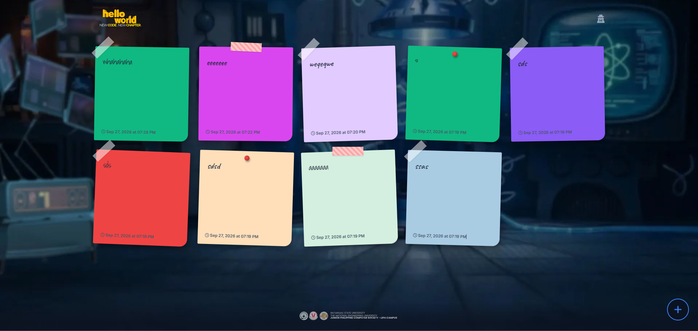

# hello world - New World.New Chapter EVENT OPEN FORUM



A real-time, anonymous digital canvas where users can drop their thoughts, messages, and ideas onto a shared board. Built specifically as a lightweight, live-updating board for events.

## ✨ Features

* **Anonymous Posting:** A friction-free way to share thoughts with no accounts or logins required.
* **Organic Design:** Every sticky note is unique, featuring randomized pastel or vivid colors, handwriting fonts, realistic tape/pin decorations, and slight rotations.
* **Near Real-Time Updates:** The board automatically syncs every 3 seconds, making it perfect for live events where multiple people are interacting at once.
* **Click-to-Zoom:** Click on any note to bring it front-and-center for easy reading.
* **Responsive Layout:** Works beautifully on everything from large desktop monitors to single-column mobile screens.
* **Anti-Spam Cooldown:** Built-in posting limits prevent users from flooding the board.

## 🛠️ Tech Stack

* **Frontend:** HTML5, Vanilla JavaScript, Custom CSS (No frameworks)
* **Backend:** Python (Flask)
* **Database:** PostgreSQL (Optimized for Vercel serverless)

## 🚀 Local Development (Optional)

If you want to run this locally for testing before deploying:

1. Clone the repository.
2. Install the requirements:
   ```bash
   pip install -r requirements.txt